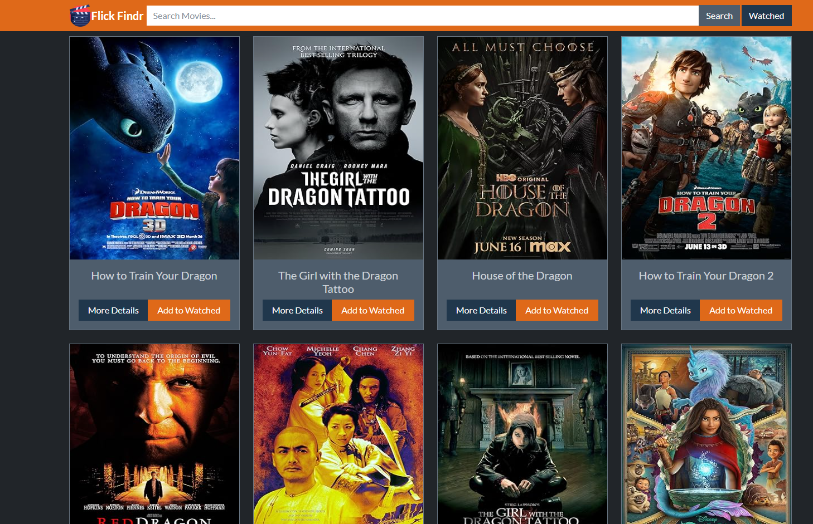
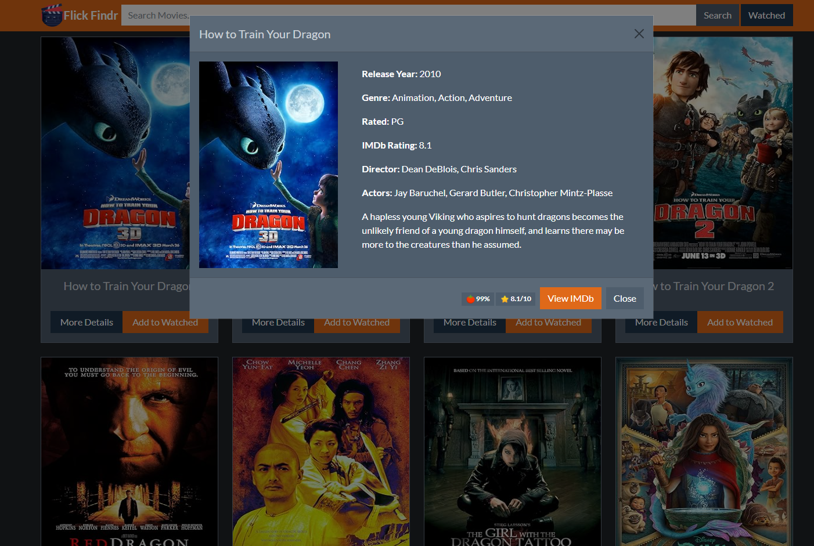
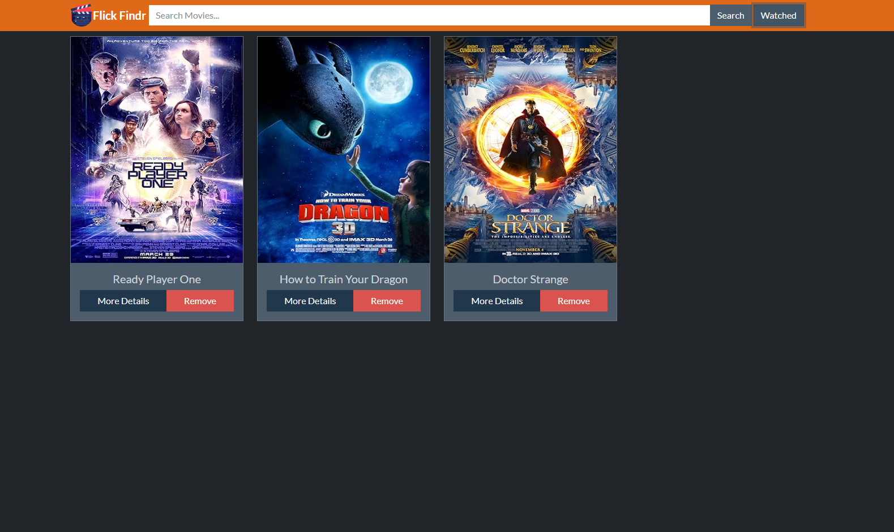

# 🎬 Flick Findr

**Flick Findr** is a simple web application that allows users to search for movies and get detailed information about them, including plot, year, rating, director, actors, and more. The app uses the OMDb API to fetch movie data and displays it in a clean, responsive UI powered by Bootstrap and jQuery.

## 🚀 Features

- **Movie Search**: Search for movies by title.
- **Movie Details**: View detailed information about the movie such as the title, year, genre, IMDb rating, director, and actors.
- **Responsive Design**: Built using Bootstrap 5, ensuring the app works well on all screen sizes.
- **Modal Display**: Movie details are shown in a modal popup for a seamless user experience.

## 🛠️ Technologies Used

- **HTML5**: For the structure of the application.
- **CSS3 (Bootstrap)**: For styling and responsive design.
- **JavaScript (jQuery)**: For DOM manipulation and event handling.
- **Axios**: For making API requests.
- **OMDb API**: External API used for fetching movie data.

## 💻 Setup Instructions

### Prerequisites

- A modern web browser (Chrome, Firefox, etc.)
- Node.js and npm (for running a local server if necessary)
- A code editor (VSCode, Sublime Text, etc.)

### How to Run Locally

1. **Clone the Repository**:
   ```bash
   git clone https://github.com/your-username/MovieDB.git
   ```

2. **Navigate to the Project Directory**:
   ```bash
   cd MovieDB
   ```

3. **Open `index.html` in a browser, or if you have a live-server**:
   ```bash
   live-server
   ```

   You can also serve the app using any local server or simply double-click the `index.html` file to open it in your default browser.

## Usage

1. Open the app in a web browser.
2. Type the name of a movie in the search bar.
3. Click the Search button.
4. Click More Details on any movie card to see detailed information in a modal.

## 🎥 Screenshots

<p align="center"></p>
<p align="center"></p>
<p align="center"></p>

## 📦 Dependencies

- jQuery
- Axios
- Bootstrap
- OMDb API
